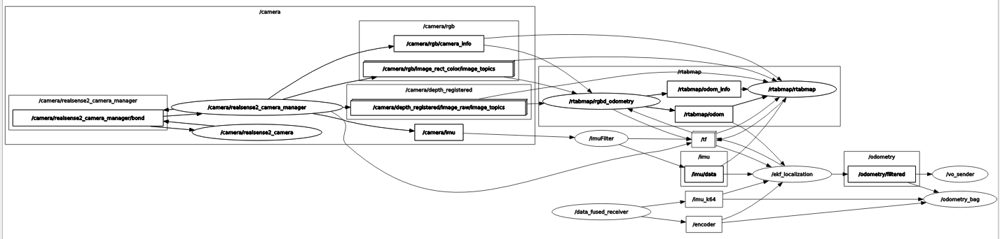

# Visual odometry ROS package
Used with:
- Realsense d435
- FRDM K64
- Encoders

See rqt_graph below:

The signals that are fused in the ekf filter are:

- /rtabmap/odom: odometry coming from the images taken by the realsense using the RTABMap package
- /encoder
- /imu/data: imu data coming from the realsense that has been prcessed by the Imu Filter Madgwick package
- /imu_k64: imu data coming from the FRDM K64

The output of the filter is published in the topic "/odometry/filtered". For mor information about the filter go to https://docs.ros.org/en/noetic/api/robot_localization/html/index.html
